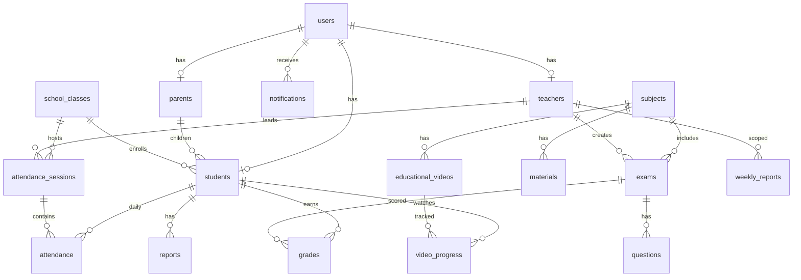

# Database Design

> ERD and table reference from Django models (`db_table` names).  
> Database engine: **Microsoft SQL Server** via `mssql-django`.

---

## 1. Entity-Relationship Description

### 1.1 Core identity

- **users** (1) ←→ (0..1) **students** | **teachers** | **parents** via OneToOne `user_id`
- **users** (1) ←→ (0..*) **notifications** as `recipient_id`
- **users** (1) ←→ (0..1) **notification_preferences**

### 1.2 Academic structure

- **school_classes** (1) ←→ (0..*) **students** (`school_class_id`)
- **school_classes** (M) ←→ (M) **teachers** via `teachers_assigned_classes`
- **subjects** (M) ←→ (M) **students** via `students_subjects`
- **subjects** (M) ←→ (M) **teachers** via `teachers_assigned_subjects`
- **teachers** + **subjects** + `class_id` string → **teacher_subject_classes** (junction with uniqueness)

### 1.3 Attendance

- **students** (1) ←→ (0..*) **attendance** — unique (`student_id`, `date`)
- **attendance_sessions** (1) ←→ (0..*) **attendance** optional `session_id`
- **teachers** (1) ←→ (0..*) **attendance_sessions** as `instructor_id`
- **school_classes** (1) ←→ (0..*) **attendance_sessions**

### 1.4 Assessment

- **subjects** (1) ←→ (0..*) **exams**
- **teachers** (1) ←→ (0..*) **exams**
- **exams** (1) ←→ (0..*) **questions**
- **students** + **exams** → **grades** — unique (`student_id`, `exam_id`)

### 1.5 Content & reports

- **subjects** (1) ←→ (0..*) **materials**, **educational_videos**
- **teachers** upload materials/videos
- **students** + **educational_videos** → **video_progress** (unique pair)
- **students** (1) ←→ (0..*) **reports**
- **weekly_reports** optional FK **teachers** when `scope=TEACHER`

### 1.6 Face encodings (outside RDBMS)

- Pickle files: `face_recognition_service/face_encodings/{student_id}.pkl`
- Linked logically by `students.student_id` string

---

## 2. ERD (Mermaid)

---

## 3. Table Catalog

### 3.1 users

| Column | Type | Notes |
|--------|------|-------|
| id | PK | BigAutoField |
| username, email, password | auth | AbstractUser |
| role | varchar(10) | ADMIN, TEACHER, STUDENT, PARENT |
| phone_number, address | optional | |
| created_at, updated_at | datetime | |

**Indexes:** `role`

---

### 3.2 students

| Column | Type | Notes |
|--------|------|-------|
| id | PK | |
| user_id | FK → users | CASCADE, unique |
| student_id | varchar(50) | unique, nullable (auto-generated) |
| date_of_birth | date | nullable |
| photo | ImageField | `student_photos/` |
| face_registered | bool | default false |
| class_level, class_id | varchar | legacy/string class id |
| school_class_id | FK → school_classes | SET_NULL |
| parent_id | FK → parents | SET_NULL |
| created_at, updated_at | datetime | |

**M2M:** `subjects` → subjects

---

### 3.3 teachers

| Column | Type | Notes |
|--------|------|-------|
| id | PK | |
| user_id | FK → users | unique |
| teacher_id | varchar(50) | unique |
| hire_date | date | nullable |
| assigned_subjects | M2M | |
| assigned_classes | M2M → school_classes | |

---

### 3.4 teacher_subject_classes

| Column | Type | Notes |
|--------|------|-------|
| teacher_id, subject_id, class_id | | UniqueConstraint triple |
| class_id | varchar(50) | e.g. G10-A |

---

### 3.5 parents

| Column | Type | Notes |
|--------|------|-------|
| id | PK | |
| user_id | FK → users | unique |
| parent_id | varchar(50) | unique |
| occupation, relationship | varchar | optional |

---

### 3.6 school_classes

| Column | Type | Notes |
|--------|------|-------|
| id | PK | |
| name, section | varchar | unique_together |
| description | text | |
| name_en, name_ar, description_en, description_ar | | modeltranslation |

---

### 3.7 subjects

| Column | Type | Notes |
|--------|------|-------|
| id | PK | |
| name, code | varchar | code unique |
| description | text | |
| name_en/ar, description_en/ar | | modeltranslation |

---

### 3.8 materials

| Column | Type | Notes |
|--------|------|-------|
| subject_id, uploaded_by_id | FK | |
| title, description | | + _en/_ar |
| file | FileField | |

---

### 3.9 attendance

| Column | Type | Notes |
|--------|------|-------|
| student_id | FK | CASCADE |
| date | date | |
| status | present \| absent | |
| source | manual \| face_recognition | |
| marked_by_id | FK teachers | nullable |
| session_id | FK attendance_sessions | nullable |
| notes | text | |

**Constraint:** unique (`student`, `date`)

---

### 3.10 attendance_sessions

| Column | Type | Notes |
|--------|------|-------|
| instructor_id | FK teachers | nullable (admin sessions) |
| date | date | |
| status | active \| completed \| cancelled | |
| class_name | varchar | |
| school_class_id | FK | |
| total_faces_detected, total_matches, total_attendance_marked | int | |
| started_at, completed_at | datetime | |

---

### 3.11 exams

| Column | Type | Notes |
|--------|------|-------|
| name | varchar | + name_en/ar |
| subject_id, teacher_id | FK | |
| duration | int minutes | |
| exam_date | date | nullable |
| class_id | varchar | optional filter |
| exam_type | quiz, midterm, final, assignment | |

---

### 3.12 questions

| Column | Type | Notes |
|--------|------|-------|
| exam_id | FK | |
| text | text | + text_en/ar |
| options | JSON | + options_en/ar |
| correct_answer | int | 0-based index |

---

### 3.13 grades

| Column | Type | Notes |
|--------|------|-------|
| student_id, exam_id | FK | unique together |
| score | decimal(5,2) | |

---

### 3.14 reports

| Column | Type | Notes |
|--------|------|-------|
| student_id | FK | |
| title, content | | |
| report_type | academic, behavioral, attendance, general | |
| generated_by_id | FK teachers | nullable |

---

### 3.15 weekly_reports

| Column | Type | Notes |
|--------|------|-------|
| week_start, week_end | date | |
| scope | SCHOOL \| TEACHER | |
| teacher_id | FK | nullable |
| status | PENDING, READY, FAILED | |
| dedupe_key | varchar | unique |
| attendance_stats, academic_stats, exam_stats, charts_payload, insights, comparison_prior_week | JSON | |
| pdf_file | FileField | optional |
| error_message | text | |

---

### 3.16 notifications

| Column | Type | Notes |
|--------|------|-------|
| recipient_id | FK users | |
| notification_type | enum | LOW_GRADE, ATTENDANCE, … |
| title, body | | + title_en/ar, body_en/ar |
| metadata | JSON | |
| dedupe_key | varchar | optional |
| read_at | datetime | null = unread |

---

### 3.17 notification_preferences

| Column | Type | Notes |
|--------|------|-------|
| user_id | OneToOne | |
| allow_low_grade, allow_attendance, allow_student_report, allow_weekly_report | bool | |

---

### 3.18 educational_videos

| Column | Type | Notes |
|--------|------|-------|
| subject_id, uploaded_by_id | FK | |
| title, description, category | | |
| video_file | FileField | mp4, webm, … |
| duration_seconds, is_published, display_order | | |

---

### 3.19 video_progress

| Column | Type | Notes |
|--------|------|-------|
| student_id, video_id | FK | unique together |
| last_position_seconds, total_watch_seconds | int | |
| is_completed, completed_at | | |

---

## 4. Referential Integrity Summary

| Relationship | On delete |
|--------------|-----------|
| Student → User | CASCADE |
| Attendance → Student | CASCADE |
| Attendance → Session | SET_NULL |
| Grade → Exam/Student | CASCADE |
| Student → Parent | SET_NULL |
| Student → SchoolClass | SET_NULL |

---

## 5. Indexes (Declared in Meta)

Notable indexes: `attendance (student, date)`, `notifications (recipient, -created_at)`, `weekly_reports (week_start, scope)`, exam/subject/teacher FK indexes.

---

## 6. Migration & Translation Notes

- Bilingual columns created by `django-modeltranslation` migrations (e.g. `subjects/migrations/0005_*`, `notifications/migrations/0002_*`).
- Run `makemigrations` / `migrate` after changing `translation.py` files.

---

## 7. TODO

- **Production backup schedule** and retention policy for SQL Server and `media/` uploads. *(Not in codebase.)*
- **Full list of M2M junction table names** as generated by Django on SQL Server — run `python manage.py sqlmigrate` in deployment environment if exact names required for DBA scripts.
